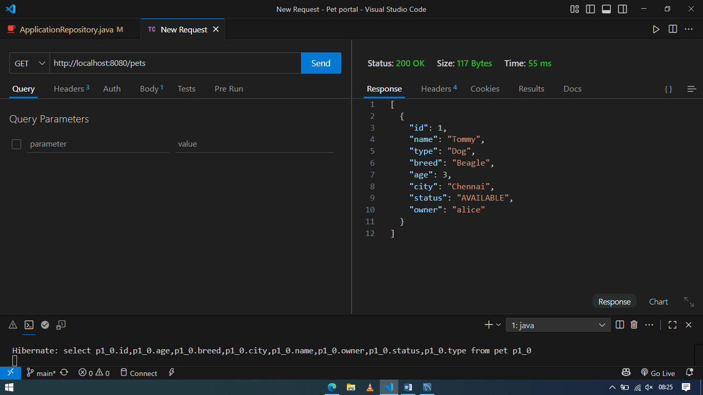
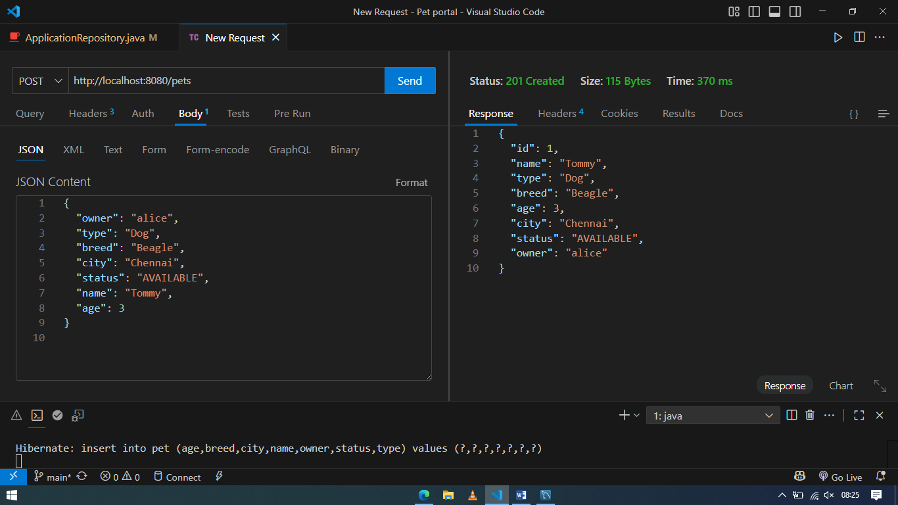
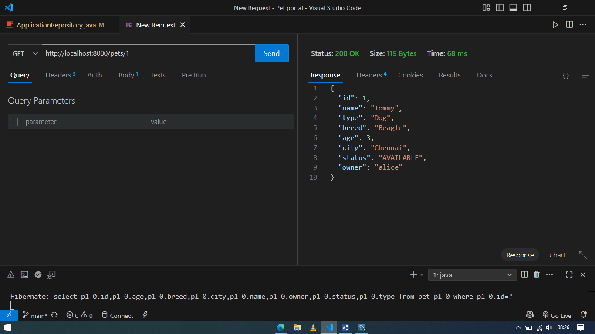
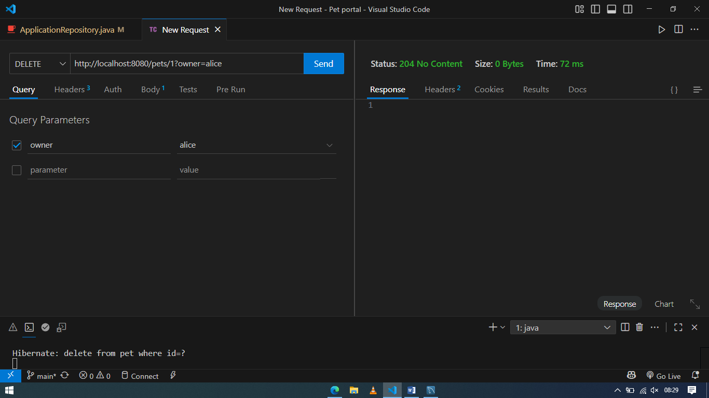
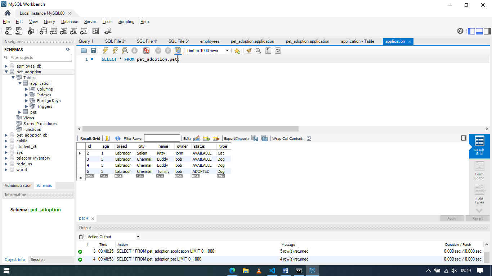
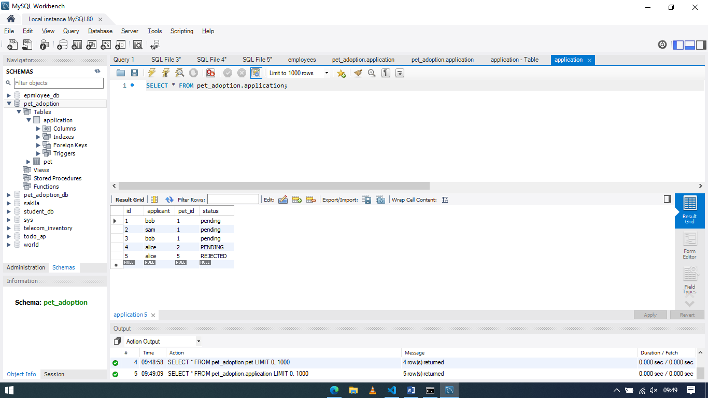

# 🐾 Pet Adoption Portal – Backend (Spring Boot)

This is the backend service for a **Pet Adoption Portal**, built using **Spring Boot + JPA + MySQL**.  
It manages **pets** (listed by owners) and **applications** (submitted by applicants to adopt pets).

---

## 🚀 Features

- Pet management (add, view, update, delete) by owners.
- Adoption applications submitted by applicants.
- Owners can approve/reject applications.
- Once an application is approved:
  - The pet is marked as **ADOPTED**.
  - Other pending applications for that pet are automatically **REJECTED**.

---

## ⚙️ Setup

1. Clone this repo and open in your IDE.
2. Update `application.properties` with your DB details:

   ```properties
   spring.datasource.url=jdbc:mysql://localhost:3306/pet_adoption
   spring.datasource.username=root
   spring.datasource.password=yourpassword
   spring.jpa.hibernate.ddl-auto=update
   spring.jpa.show-sql=true
   ```

3. Run the application:

   ```bash
   mvn spring-boot:run
   ```

4. Server runs at: **[http://localhost:8080](http://localhost:8080)**

---

## 🐾 Pet Endpoints

### **Pet1 → Create a Pet**

**POST** `/pets`

```json
{
  "name": "Buddy",
  "type": "Dog",
  "breed": "Labrador",
  "age": 3,
  "city": "Chennai",
  "status": "AVAILABLE",
  "owner": "bob"
}
```

---

### **Pet2 → Get All Pets**

**GET** `/pets`

---

### **Pet3 → Get Pet by ID**

**GET** `/pets/1`

---

### **Pet4 → Update Pet (Owner only)**

**PUT** `/pets/1?owner=bob`

```json
{
  "name": "Buddy",
  "type": "Dog",
  "breed": "Golden Retriever",
  "age": 4,
  "city": "Bangalore",
  "status": "AVAILABLE",
  "owner": "bob"
}
```

---

### **Pet5 → Delete Pet**

**DELETE** `/pets/1?owner=bob`

---

## 📄 Application Endpoints

### **App1 → Apply for Adoption**

**POST** `/applications`

```json
{
  "pet": { "id": 1 },
  "applicant": "alice"
}
```

✔ Status is automatically set to **PENDING**.

---

### **App2 → Get All Applications**

**GET** `/applications`

---

### **App3 → Get Applications for a Pet**

**GET** `/applications/pet/1`

---

### **App4 → Get Applications by Applicant**

**GET** `/applications/mine?applicant=alice`

---

### **App5 → Update Application Status (Generic)**

**PUT** `/applications/1?status=APPROVED`

---

### **App6 → Approve Application (Owner only)**

**PUT** `/applications/1/approve?owner=bob`

✅ Effects:

- Application #1 → **APPROVED**
- Pet → **ADOPTED**
- Other pending applications for same pet → **REJECTED**

---

### **App7 → Reject Application (Owner only)**

**PUT** `/applications/1/reject?owner=bob`

---

## 🧪 Testing Flow (Recommended)

1. **Create a pet** → `POST /pets`
2. **View pets** → `GET /pets`
3. **Apply for adoption** → `POST /applications`
4. **Check applications for pet** → `GET /applications/pet/{id}`
5. **Owner approves** → `PUT /applications/{id}/approve?owner={ownerName}`
6. **Check pet again** → `GET /pets/{id}` → should be `ADOPTED`
7. **Other applications** → will be marked `REJECTED`

---

## 📌 Notes

- Owners can only update/delete their own pets.
- Owners can only approve/reject applications for pets they own.
- Applicants cannot apply twice for the same pet.

---

## 👨‍💻 Tech Stack

- Java 17+
- Spring Boot 3
- MySQL

---

## 📸 Screenshots

Here are some screenshots of the portal:

<p align="center" style="display:flex;gap:10px">
  
  
</p>
<p align="center" style="display:flex;gap:10px">
  
  
</p>
<p align="center" style="display:flex;gap:10px">
  
  
</p>
