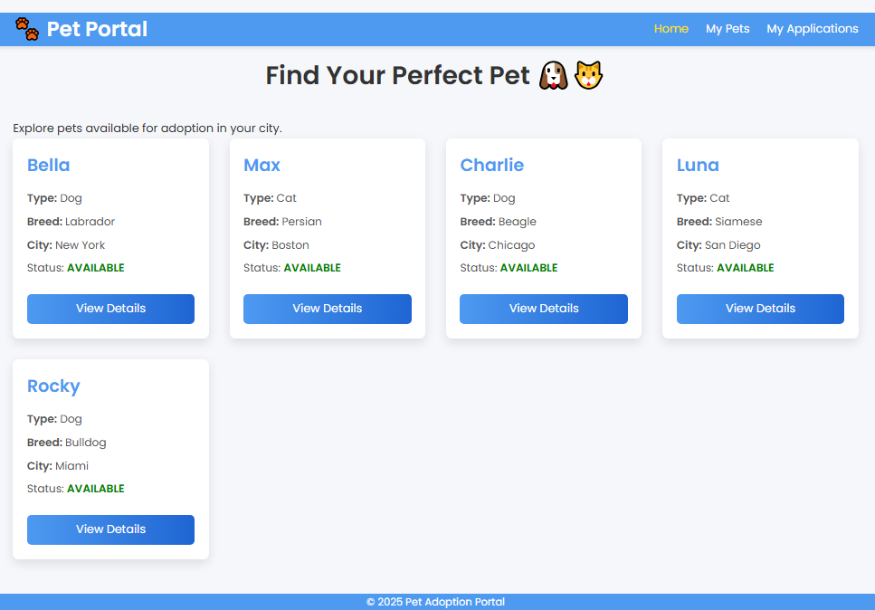
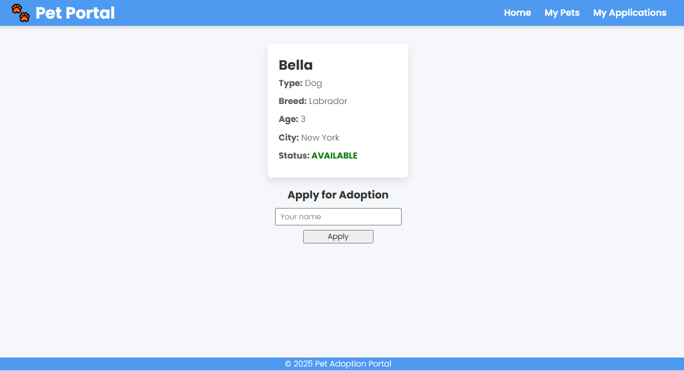
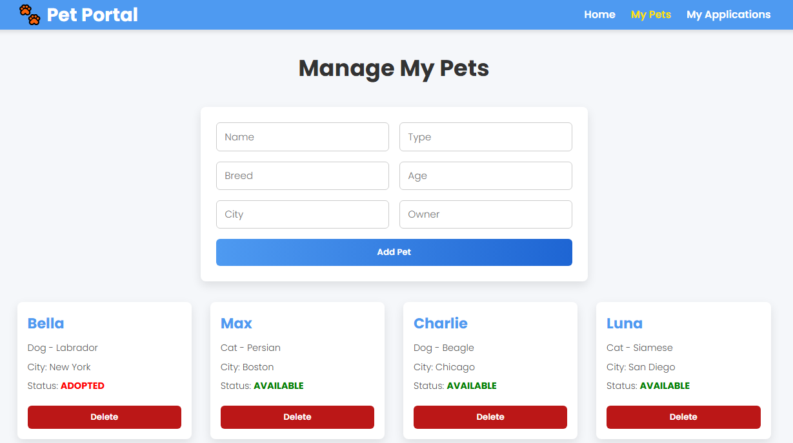
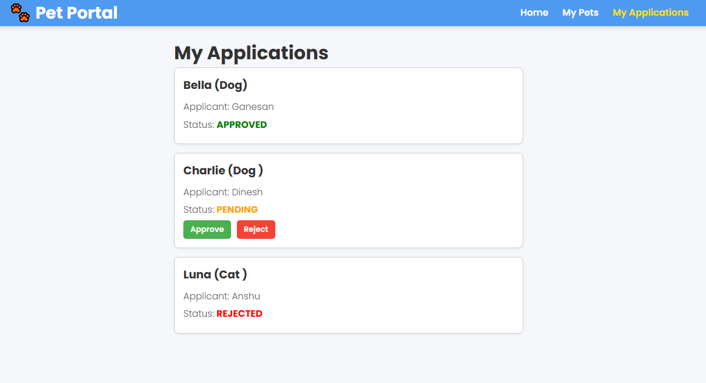

# 🐾 Pet Adoption Portal

A full-stack pet adoption application that allows users to browse pets, apply for adoption, and lets pet owners manage applications.

---

## 📂 Project Structure

Explore within this repo

---

## ⚡ Features

### User

- View all pets in the gallery.
- Search pets by type, breed, and city.
- View pet details and apply for adoption.

### Pet Owner

- Add, update, and delete pets.
- View adoption applications for owned pets.
- Approve or reject applications.

### Admin / Demo Features

- See all applications (React sub-app for dynamic approve/reject).

---

## 🐶 Sample Pets

| Name    | Type | Breed    | Age | City      | Owner |
| ------- | ---- | -------- | --- | --------- | ----- |
| Bella   | Dog  | Labrador | 3   | New York  | Alice |
| Max     | Cat  | Persian  | 2   | Boston    | Bob   |
| Charlie | Dog  | Beagle   | 4   | Chicago   | Carol |
| Luna    | Cat  | Siamese  | 1   | San Diego | Dave  |
| Rocky   | Dog  | Bulldog  | 5   | Miami     | Eve   |

---

## 🔌 Backend API

### Pets

- `GET /pets` - Get all pets
- `GET /pets/{id}` - Get pet by ID
- `POST /pets` - Add new pet (owner only)
- `PUT /pets/{id}` - Update pet (owner only)
- `DELETE /pets/{id}` - Delete pet (owner only)

### Applications

- `GET /applications` - Get all applications
- `GET /applications/pet/{petId}` - Get applications by pet
- `GET /applications/mine?applicant=<name>` - Get applications by applicant
- `POST /applications` - Apply for adoption
- `PUT /applications/{id}/approve?owner=<owner>` - Approve application
- `PUT /applications/{id}/reject?owner=<owner>` - Reject application

---

## 🛠️ Setup Instructions

### Backend

1. Open the project in **IntelliJ / Eclipse**.
2. Make sure **MySQL** is running.
3. Update `application.properties` with DB credentials:

   ```properties
   spring.datasource.url=jdbc:mysql://localhost:3306/pet_portal
   spring.datasource.username=root
   spring.datasource.password=your_password
   spring.jpa.hibernate.ddl-auto=update
   ```

4. Run Spring Boot app.
5. Backend runs at: `http://localhost:8080`

### Frontend

1. Open `Frontend` folder in VS Code.
2. Start live server for `index.html`, `pet.html`, `mypets.html`, and `myapplications.html`.
3. Make sure `api.js` points to backend:

   ```javascript
   const API_BASE = "http://localhost:8080";
   ```

### React Sub-App (Applications)

1. Go to `react-applications` folder.
2. Install dependencies:

   ```bash
   npm install
   ```

3. Build for production:

   ```bash
   npm run build
   ```

4. Make sure `myapplications.html` includes:

   ```html
   <script src="react-applications/dist/main.js"></script>
   ```

---

## 🖼️ Screenshots

### Home Page

<p align="center" style="display:flex;gap:10px">
  
</p>

### Application

<p align="center" style="display:flex;gap:10px">
  
</p>

### My Pets (Owner)

<p align="center" style="display:flex;gap:10px">
  
</p>

### Applications status

<p align="center" style="display:flex;gap:10px">
  
</p>

---

## ⚠️ Notes

- Approve/reject buttons only work if the logged-in user is the **owner of the pet**.
- React app handles the dynamic applications list; rest of the frontend is plain HTML/CSS/JS.
- Make sure **CORS** is enabled in Spring Boot:

  ```java
  @Bean
  public WebMvcConfigurer corsConfigurer() {
     return new WebMvcConfigurer() {
        @Override
        public void addCorsMappings(CorsRegistry registry) {
              registry.addMapping("/**").allowedOrigins("*");
        }
     };
  }
  ```

---

## 💻 Tech Stack

- **Backend:** Spring Boot, Java, MySQL, JPA
- **Frontend:** HTML, CSS, JS, React (for applications)
- **Build Tools:** NPM, Webpack

---

## 🔗 Demo

Run backend and open `index.html` via Live Server to start exploring the Pet Adoption Portal.
